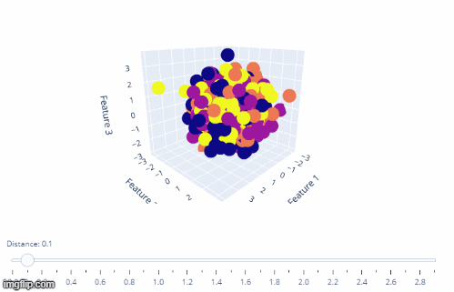
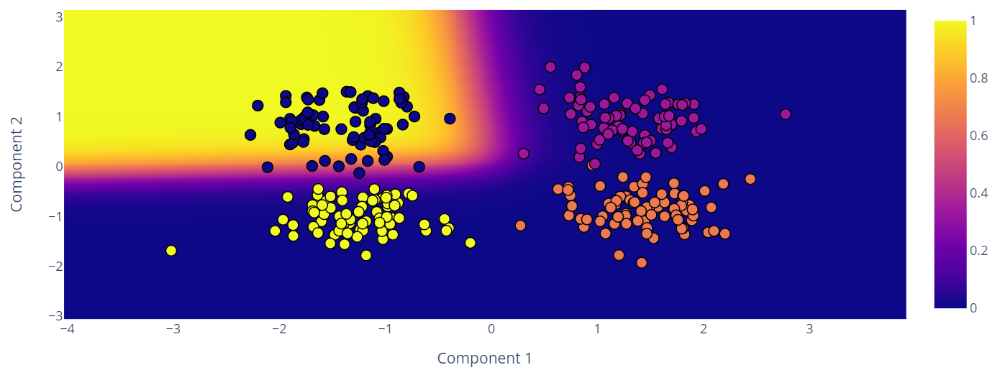

# Principal Component Disaster

The code in this Git repository visualizes the effect of dimensionality reduction of principal component analysis (PCA). Isotropic, Gaussian distributed data with 
four classes is generated. The synthetically created data is classified with a logistic regression model. Interactive Plotly charts visualize the difference between
data sets where classes can be differentiated easily and those where classes are very similar in feature space and are therefore hard to distinguish.

The four classes are four [data blobs](https://scikit-learn.org/stable/modules/generated/sklearn.datasets.make_blobs.html "sklearn documentation") in three 
dimensional space.
The data is reduced to two dimensions with PCA and the resulting classification plotted with decision boundaries and probability surfaces.
### Example of blob data creation

### Surface probability with test data

